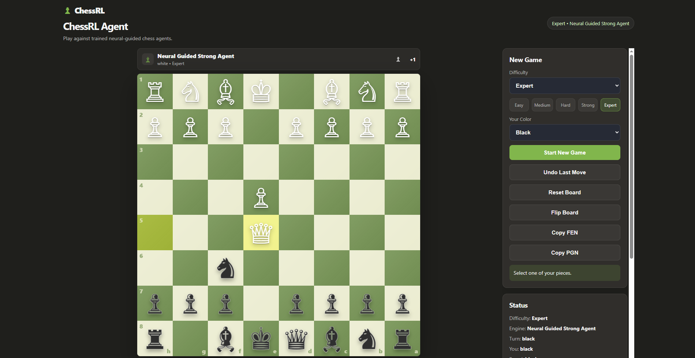

# ChessRL Agent

A reinforcement-learning and neural-guided chess agent project with a playable browser-based chess interface.



This project started as a simple command-line chess environment and gradually evolved into a full chess AI playground. It includes baseline chess agents, Q-learning experiments, imitation learning, a neural policy network, neural-guided search, evaluation tools, and a Flask web application for playing against the trained agents.

## Features

* Play chess against multiple AI agents
* Browser-based chess board inspired by modern online chess platforms
* Click-to-move and drag-and-drop movement
* Difficulty levels: Easy, Medium, Hard, Strong, Expert
* Move history with SAN notation
* Legal move display
* Captured pieces and material advantage display
* Board flipping
* FEN and PGN copy actions
* Keyboard shortcuts
* Reinforcement-learning baseline
* Neural policy model trained with imitation learning
* Neural-guided search agent
* Randomized opening evaluation for more reliable testing

## Agent Levels

| Difficulty | Agent                      | Description                                          |
| ---------- | -------------------------- | ---------------------------------------------------- |
| Easy       | Random Agent               | Selects random legal moves                           |
| Medium     | Material Agent             | Uses material-based move selection                   |
| Hard       | Minimax Agent              | Uses depth-limited minimax search                    |
| Strong     | Neural Guided Agent        | Combines neural policy suggestions with search       |
| Expert     | Neural Guided Strong Agent | Stronger neural-guided search with deeper evaluation |

## Project Structure

```text
ChessRL-Agent/
├── data/
│   └── imitation_positions.jsonl
├── docs/
│   └── images/
│       └── chessrl-web-app.png
├── models/
│   ├── policy_network.pt
│   └── q_learning_agent.json
├── results/
│   └── evaluation summaries
├── src/
│   ├── agents/
│   │   ├── random_agent.py
│   │   ├── material_agent.py
│   │   ├── minimax_agent.py
│   │   ├── q_learning_agent.py
│   │   ├── neural_policy_agent.py
│   │   └── neural_guided_agent.py
│   ├── evaluation/
│   │   └── evaluate_agents.py
│   ├── neural/
│   │   ├── action_encoder.py
│   │   ├── board_encoder.py
│   │   ├── policy_network.py
│   │   ├── test_encoding.py
│   │   └── test_policy_network.py
│   ├── training/
│   │   ├── generate_self_play_data.py
│   │   ├── train_q_learning.py
│   │   ├── generate_imitation_data.py
│   │   └── train_policy_network.py
│   ├── play_cli.py
│   └── web_app.py
├── static/
│   ├── app.js
│   └── styles.css
├── templates/
│   └── index.html
├── requirements.txt
└── README.md
```

## Installation

Clone the repository:

```bash
git clone https://github.com/mohammad-azimi/ChessRL-Agent.git
cd ChessRL-Agent
```

Create and activate a virtual environment:

```bash
python -m venv .venv
.venv\Scripts\activate
```

Install dependencies:

```bash
pip install -r requirements.txt
```

## Run the Browser Chess App

Start the Flask app:

```bash
python src/web_app.py
```

Open the app in your browser:

```text
http://127.0.0.1:5000
```

Recommended mode:

```text
Difficulty: Expert
Your Color: Black
Start New Game
```

## Keyboard Shortcuts

| Key | Action         |
| --- | -------------- |
| N   | Start new game |
| R   | Reset board    |
| U   | Undo last move |
| F   | Flip board     |
| C   | Copy FEN       |
| P   | Copy PGN       |

The shortcuts are based on physical keyboard keys, so they still work when the keyboard layout is Persian, Russian, or another non-English layout.

## Run the Command-Line Game

```bash
python src/play_cli.py
```

Available opponents:

```text
1 - Random Agent
2 - Material Agent
3 - Minimax Agent
4 - Q-learning Agent
5 - Neural Policy Agent
6 - Neural Guided Agent
7 - Neural Guided Strong Agent
```

## Train the Q-learning Agent

```bash
python src/training/train_q_learning.py --episodes 2000 --max-plies 120
```

The trained Q-learning table is saved to:

```text
models/q_learning_agent.json
```

## Generate Imitation Learning Data

Generate expert-style training positions using the minimax expert:

```bash
python src/training/generate_imitation_data.py --positions 10000 --expert-depth 2 --max-plies 100
```

The generated dataset is saved to:

```text
data/imitation_positions.jsonl
```

## Train the Neural Policy Network

```bash
python src/training/train_policy_network.py --epochs 15 --batch-size 128 --learning-rate 0.0003
```

The trained model is saved to:

```text
models/policy_network.pt
```

## Evaluate the Agents

Run evaluation with randomized openings:

```bash
python src/evaluation/evaluate_agents.py --games 10 --max-plies 120 --opening-plies 4
```

Example evaluation result from the strongest agent:

```text
neural_guided_strong vs random
Games: 10
Opening plies: 4
White wins: 10
Black wins: 0
Draws: 0

neural_guided_strong vs q_learning
Games: 10
Opening plies: 4
White wins: 10
Black wins: 0
Draws: 0

neural_guided_strong vs minimax
Games: 10
Opening plies: 4
White wins: 4
Black wins: 0
Draws: 6

minimax vs neural_guided_strong
Games: 10
Opening plies: 4
White wins: 1
Black wins: 3
Draws: 6
```

## Main Idea

The strongest agent combines two components:

1. A neural policy network that proposes promising legal moves.
2. A guided minimax-style search that evaluates the best candidate moves.

This hybrid approach performs significantly better than the raw neural policy model and simple baselines. It also remains competitive against a depth-2 minimax agent.

## Technical Highlights

* Board encoding for neural-network input
* Move-to-action and action-to-move encoding
* Legal action masking during training and inference
* Imitation learning from a minimax expert
* Q-learning baseline
* Neural-guided candidate move search
* Flask API for playing against agents
* Browser-based chess interface
* FEN and PGN export
* Randomized-opening evaluation

## Tech Stack

* Python
* python-chess
* PyTorch
* Flask
* HTML
* CSS
* JavaScript

## Notes

The trained model files may not be included in the repository depending on Git settings. If the model files are missing, regenerate them using the training commands above.

Recommended training flow:

```bash
python src/training/generate_imitation_data.py --positions 10000 --expert-depth 2 --max-plies 100
python src/training/train_policy_network.py --epochs 15 --batch-size 128 --learning-rate 0.0003
python src/web_app.py
```

## License

This project is licensed under the MIT License. See the [LICENSE](LICENSE) file for details.
